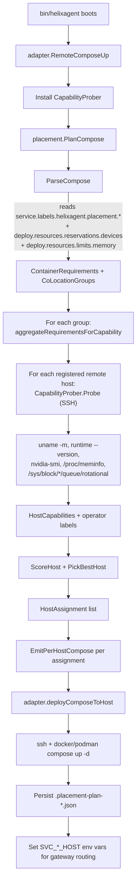

# Container Placement & Partitioned Distribution

Authoritative description of how HelixAgent distributes containers
across remote hosts WITHOUT duplication. Pairs with
`docs/development/container-resource-policy.md` (per-service resource
budgets).

## TL;DR

- The orchestrator (`bin/helixagent` running on the local host) is the
  **single source of truth** for placement. No external script touches
  container state per CONST-031.
- Each containerized service runs on **EXACTLY ONE** host across the
  CONTAINERS_REMOTE_HOST_N_* set. No replication. Duplication =
  divergent writes = data corruption.
- Services with `depends_on` form a **co-location group** and are
  always placed on the same host. (Docker Compose `depends_on` is
  intra-host; cross-host `depends_on` does not work.)
- Placement is computed at boot via the existing scheduler in
  `containers/pkg/scheduler` (default strategy:
  `StrategyResourceAware`), using live host probes from
  `containers/pkg/remote.Prober`.
- The plan for each compose file is persisted to
  `<project>/.placement-plan-<compose>.json` for operator audit and
  for the verification Challenge.

## Architecture

```
+------------------+
|  bin/helixagent  |  ── boot ──┐
| (orchestrator)   |             │
+------------------+             ▼
       │             internal/placement
       │                 ParseCompose      → ContainerRequirements
       │                 PlanCompose       → PlacementPlan
       │                 EmitPerHostCompose → per-host compose subset
       │
       │             containers/pkg/scheduler  (existing, unchanged)
       │             containers/pkg/remote     (existing, unchanged)
       │             containers/pkg/serviceregistry (existing, unchanged)
       ▼
+----------+   +----------+   +----------+
| host A   |   | host B   |   | host C   |
| podman   |   | docker   |   | …        |
| services |   | services |   | services |
+----------+   +----------+   +----------+
       ▲             ▲              ▲
       └─────────────┴──────────────┘
            SVC_<X>_HOST env vars
            tell internal/config
            which host owns each
            service at runtime
```

## Files in this fix

| File | Purpose |
|------|---------|
| `internal/placement/parser.go` | Parse a docker-compose file → `[]scheduler.ContainerRequirements`. Reads `deploy.resources.{limits,reservations}` (with `${VAR:-default}` env-var unwrap), `depends_on` (list + map forms), `profiles`, GPU device reservations. Computes co-location groups via union-find over the `depends_on` graph. |
| `internal/placement/emitter.go` | Given a source compose + a list of services, write a filtered compose containing ONLY those services (preserving networks, volumes, top-level keys). |
| `internal/placement/planner.go` | High-level `PlanCompose(ctx, file, profile, hostManager, opts...) → *Plan`. Groups requirements by co-location label, schedules each group as one atomic unit, returns `[]HostAssignment`. |
| `internal/placement/persist.go` | `WritePlanJSON` / `ReadPlanJSON` for the per-compose plan record. |
| `cmd/helixagent/placement_deploy.go` | `deployComposePartitioned` — used by `cmd/helixagent/main.go` instead of `RemoteComposeUp` for partitioned distribution. Stages per-host filtered composes inside the project tree so build contexts (`context: ../..`) resolve correctly. Sets `SVC_<SERVICE>_HOST` env vars after each successful host deploy. |
| `internal/adapters/containers/adapter.go` | Adds `HostManager()` getter and `DeployComposeToHost(ctx, hostName, file, profile)` wrapper around the existing private `deployComposeToHost`. |
| `challenges/scripts/partitioned_distribution_challenge.sh` | Reproduction guard (CONST-032). Asserts every container appears on exactly one host. |
| `internal/placement/*_test.go` | Unit invariants: co-location preservation, no duplicates, every service placed. Uses a fake executor so the scheduler runs without SSH. |

## Co-location groups

Services that depend on each other must be co-located. Examples in the
current codebase:

- **`cognee` group** (in `docker-compose.yml`):
  `cognee` → depends on `postgres`, `redis`, `chromadb`. The four
  services always land on the same host.
- **MCP backend pairs** (in `docker/mcp/docker-compose.mcp-servers.yml`):
  `mcp-redis` + `mcp-redis-backend`, `mcp-mongodb` + `mcp-mongodb-backend`,
  `mcp-qdrant` + `mcp-qdrant-backend` — each pair is one group.

Co-location is automatically derived from `depends_on`. No manual
grouping config.

## Adding a new service

Same as before:

1. Add the service block to the appropriate compose file.
2. Set `deploy.resources.limits` + `reservations` per the tier table
   in `container-resource-policy.md`.
3. If it depends on other services, declare `depends_on:` — placement
   will follow.
4. If it requires a GPU, declare it via:
   ```yaml
   deploy:
     resources:
       reservations:
         devices:
           - driver: nvidia
             count: 1
             capabilities: [gpu]
   ```
   The parser turns this into a `scheduler.GPURequirement` and the
   scheduler's `StrategyGPUAffinity` will steer placement.

## Adding a new host

Append a `CONTAINERS_REMOTE_HOST_N_*` block to `containers/.env`. The
loader stops at the first absent `_NAME`, so N can scale freely (1..100
per CONST-031). The scheduler picks up the new host on the next boot.

## Strategy selection

Default is `scheduler.StrategyResourceAware` — picks the host with the
most available memory + CPU after subtracting current placements. Other
strategies in `containers/pkg/scheduler` are also available
(`StrategyRoundRobin`, `StrategySpread`, `StrategyBinPack`,
`StrategyAffinity`, `StrategyGPUAffinity`). Switch via the `opts`
parameter in `PlanCompose`.

## Why we partition rather than replicate

Replicated deployment (the previous behaviour) put a copy of postgres,
redis, chromadb, and cognee on every remote host. Each cognee instance
wrote to its local postgres, so the four hosts had four independent
postgres databases that diverged. Reads through the gateway returned
data from whichever host responded first. This is **data corruption
under any meaningful workload** and was the trigger for partitioning
(BUGFIXES.md Issue #52).

## Verification

```bash
# After a fresh boot:
challenges/scripts/partitioned_distribution_challenge.sh
# Asserts: every helixagent-* container exists on EXACTLY ONE host.

# Unit tests (no docker / SSH required):
go test -count=1 ./internal/placement/...
# Asserts: co-location, no duplicates, every service placed.

# Inspect the plan persisted by the orchestrator:
cat .placement-plan-docker-compose.yml.json     | jq
cat .placement-plan-docker-compose.mcp-servers.yml.json | jq
```

## Future work (out of scope for Issue #52)

- **Volume migration when a service moves hosts.** Today, moving postgres
  from host A → host B = data loss. Add an opt-in volume rsync pass so a
  rebalance preserves state.
- **Live rebalancing.** `containers/pkg/distribution.Distributor.Rebalance`
  exists but isn't wired in; could trigger on host degraded events.
- **Operator-overridable per-service pinning** via env var
  `HELIXAGENT_PLACE_<SERVICE>=<host>` for emergencies. Today the
  scheduler's choice is final.

---

# Capability-aware placement (Issue #53)

The previous section established the **structural** invariant — every
service runs on exactly one host. This section adds the **semantic**
invariant: each service is placed on a host that can actually run it
well, taking into account the host's measured capabilities.

## What gets measured per host

A `CapabilityProber` runs once per `RemoteComposeUp` invocation, in a
single SSH round-trip per host, and collects:

| Field | Source | Used for |
|-------|--------|----------|
| `Arch` | `uname -m` | hard constraint `require.arch` |
| `Runtime` + version | `docker version` / `podman version` | hard constraint `require.runtime` |
| `HasGPU` + vendor + count | `nvidia-smi` / `rocm-smi` / `lspci` fallback | hard constraint `require.gpu` |
| `MemoryTotalMB` / `MemoryFreeMB` | `/proc/meminfo` | hard constraint memory-fit + auto-derived `MemoryClass` |
| `CPUCores` | `nproc` | informational |
| `CPUMhz` | `lscpu` "CPU max MHz" or `/proc/cpuinfo` "cpu MHz" | auto-derived `CPUClass` |
| `DiskFreeMB` | `df -BM /` | auto-derived `DiskSpaceClass` |
| `DiskTotalMB` | `df -BM --output=size /` | informational (capacity audit) |
| `StorageType` | `/sys/block/nvme*` exists ⇒ `nvme`; non-rotational sd*/vd* ⇒ `ssd`; rotational ⇒ `hdd` | soft preference `prefer.storage_type` |
| `StorageClass` | derived from `StorageType`: nvme/ssd ⇒ "fast", hdd ⇒ "slow" | soft preference `prefer.storage` (legacy/coarse axis) |
| `MemoryClass` | derived: ≥32 GiB high, ≥8 GiB medium, else low | soft preference `prefer.memory` |
| `NetworkSpeedMbps` | max of `/sys/class/net/*/speed` for non-loopback/non-virtual interfaces | auto-derived `NetworkClass` |
| `NetworkClass` | derived: ≥10000 Mbps high, ≥1000 medium, else low | soft preference `prefer.network` |
| `CPUClass` | derived: ≥3000 MHz fast, ≥2000 medium, else slow | soft preference `prefer.cpu` |
| `DiskSpaceClass` | derived: ≥500 GB free large, ≥100 GB medium, else small | soft preference `prefer.disk_space` |
| Operator labels | `CONTAINERS_REMOTE_HOST_N_LABELS` (`storage=fast,storage_type=nvme,memory=high,network=high,cpu=fast,disk_space=large`) | override the auto-derived classes |

Operator labels always win over probed values — useful when probing
gets fooled (e.g., a SAN-mounted disk that reports `rotational=1` but
behaves like a fast SSD).

## How services declare their needs

Services use Docker Compose `labels:` with the
`helixagent.placement.{require,prefer}.X` keys:

```yaml
services:
  postgres:
    labels:
      helixagent.placement.prefer.storage: fast    # soft preference
      helixagent.placement.prefer.memory:  high
  sglang:
    labels:
      helixagent.placement.require.gpu:    nvidia  # hard constraint
      helixagent.placement.prefer.memory:  high
  cpu-only:
    labels:
      helixagent.placement.require.arch:   amd64
```

| Label | Type | Values | Meaning |
|-------|------|--------|---------|
| `require.gpu` | hard | `true`, `false`, `nvidia`, `amd`, `intel` | Hosts without this GPU vendor are excluded |
| `require.runtime` | hard | `docker`, `podman`, `any` | Hosts with a different runtime are excluded |
| `require.arch` | hard | `amd64`, `arm64`, `any` | Hosts with a different arch are excluded |
| `prefer.storage` | soft | `fast`, `medium`, `slow` | Adds +10 to score on matching host (legacy/coarse axis) |
| `prefer.storage_type` | soft | `nvme`, `ssd`, `hdd` | Adds +9 to score (nvme > ssd > hdd, tolerant upgrade — asking ssd is satisfied by nvme) |
| `prefer.memory` | soft | `high`, `medium`, `low` | Adds +8 to score (tolerant upgrade — asking medium is satisfied by high) |
| `prefer.cpu` | soft | `fast`, `medium`, `slow` | Adds +7 to score (tolerant upgrade) |
| `prefer.disk_space` | soft | `large`, `medium`, `small` | Adds +6 to score (tolerant upgrade — asking medium is satisfied by large) |
| `prefer.network` | soft | `high`, `medium`, `low`, `fast` (alias for high) | Adds +5 to score (tolerant upgrade) |

**Auto-derived requirements** (no manual label needed):

- A `deploy.resources.reservations.devices` entry with `capabilities: [gpu]` ⇒ `require.gpu = <driver>` (nvidia/amd/intel).
- `deploy.resources.limits.memory ≥ 8 GiB` ⇒ `prefer.memory = high`.
- `deploy.resources.limits.memory ≥ 2 GiB` ⇒ `prefer.memory = medium`.

So even composes that don't carry the new labels still benefit from
auto-derived hints based on their resource budgets.

## Scoring formula

For each (group, host) pair the scorer in
`internal/placement/capability.go::ScoreHost` evaluates:

```
1. Hard constraints (eligibility gate):
   require.gpu       — host.HasGPU AND vendor match required vendor
   require.runtime   — host.Runtime == required
   require.arch      — host.Arch == required
   memory fit        — group.MemoryMB ≤ 0.9 × host.MemoryFreeMB

   If any fails → host INELIGIBLE for this group, regardless of soft prefs.

2. Soft preferences (additive to score):
   prefer.storage match       → +10  (legacy fast/medium/slow)
   prefer.storage_type match  → +9   (nvme/ssd/hdd — more specific)
   prefer.memory match        → +8   (tolerant upgrade)
   prefer.cpu match           → +7   (tolerant upgrade)
   prefer.disk_space match    → +6   (tolerant upgrade)
   prefer.network match       → +5   (tolerant upgrade; "fast" aliases to "high")

3. Load penalty (subtractive):
   −3 × host.PlacementCount

   Less-loaded hosts win when other factors tie.

4. Tie-break: alphabetical host name (deterministic across reboots).
```

The exact weights are exported as `placement.ScoringWeights` so tests
and docs reference one source of truth.

The exact weights live in `ScoringWeights` in `capability.go` so they
can be tuned (and tests reference one source of truth).

## Placement flow at boot



## How to add a new service with capability needs

1. Add the service to the appropriate compose file with proper
   `deploy.resources.{limits,reservations}` per the tier table in
   `container-resource-policy.md`.
2. Declare any HARD constraints via `labels:`:
   ```yaml
   services:
     gpu-vision:
       labels:
         helixagent.placement.require.gpu: nvidia
   ```
3. Declare any SOFT preferences:
   ```yaml
       labels:
         helixagent.placement.prefer.storage: fast
         helixagent.placement.prefer.memory:  high
   ```
4. If the service has `depends_on` ties to others, the placement
   layer automatically co-locates them — no separate group label
   needed.
5. Re-run `go test ./internal/placement/...` and the
   `capability_aware_placement_challenge.sh` to confirm placement
   matches expectations.

## How to configure host capabilities

For each remote host in `containers/.env`:

```bash
CONTAINERS_REMOTE_HOST_1_NAME=thinker
CONTAINERS_REMOTE_HOST_1_ADDRESS=thinker.local
CONTAINERS_REMOTE_HOST_1_USER=milosvasic
CONTAINERS_REMOTE_HOST_1_RUNTIME=podman
# Operator class overrides — wins over auto-detected values.
CONTAINERS_REMOTE_HOST_1_LABELS=storage=fast,memory=high,network=high
```

If you want the prober to drive everything, omit the `LABELS` line —
classes are derived from `/proc/meminfo` (memory) and
`/sys/block/*/queue/rotational` (storage). Network class is always
manual; the prober has no reliable way to infer LAN throughput.

## Verification

```bash
# Unit + benchmark (no SSH required):
go test -count=1 ./internal/placement/...
go test -bench=. ./internal/placement/...

# After a fresh boot:
challenges/scripts/partitioned_distribution_challenge.sh    # structural
challenges/scripts/capability_aware_placement_challenge.sh  # semantic
cat .placement-plan-docker-compose.yml.json | jq            # plan audit
cat .placement-plan-docker-compose.mcp-servers.yml.json | jq
```

## Where each piece of code lives

| File | Responsibility |
|------|---------------|
| `internal/placement/capability.go` | `HostCapabilities` struct, `ScoreHost`, `PickBestHost`, `ScoringWeights` constants |
| `internal/placement/prober.go` | `CapabilityProber` — SSH round-trip + parsing into `HostCapabilities` |
| `internal/placement/prober_global.go` | `SetCapabilityProber` package-singleton wiring |
| `internal/placement/parser.go` | Reads `helixagent.placement.*` labels from compose; auto-derives `require.gpu` from device reservations and `prefer.memory` from limits |
| `internal/placement/planner.go` | Aggregates per group, calls `PickBestHost`, builds `Plan` with reasons |
| `internal/placement/persist.go` | `WritePlanJSON` — operator-readable plan record |
| `internal/adapters/containers/adapter.go` | `RemoteComposeUp` installs prober, runs `PlanCompose`, deploys per-host |
| `challenges/scripts/capability_aware_placement_challenge.sh` | Asserts the live placement matches the host capabilities |
| `internal/placement/capability_test.go` | Unit tests for every constraint and preference combination |
| `internal/placement/prober_test.go` | Unit tests for the SSH probe parser (uses fake executor) |
| `internal/placement/capability_bench_test.go` | Benchmarks for `PickBestHost` at scale |

